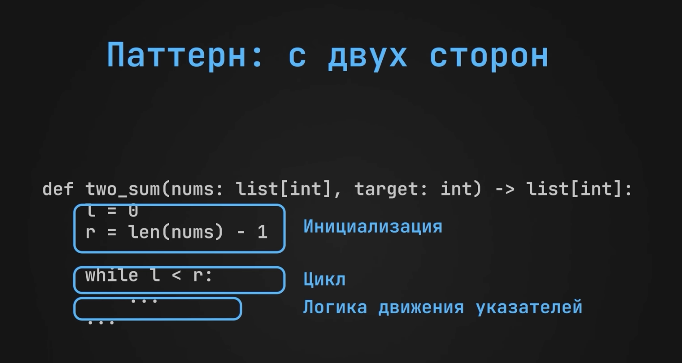
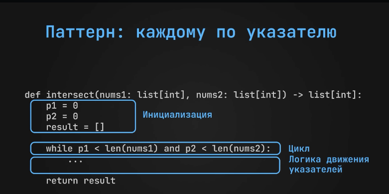
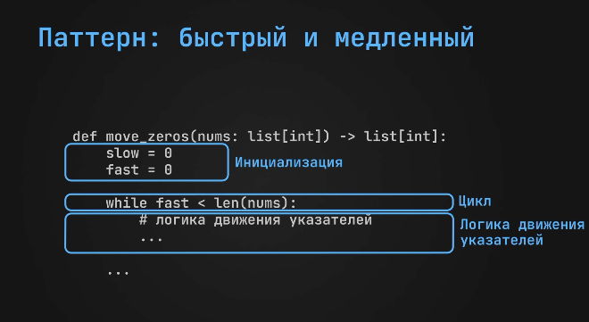
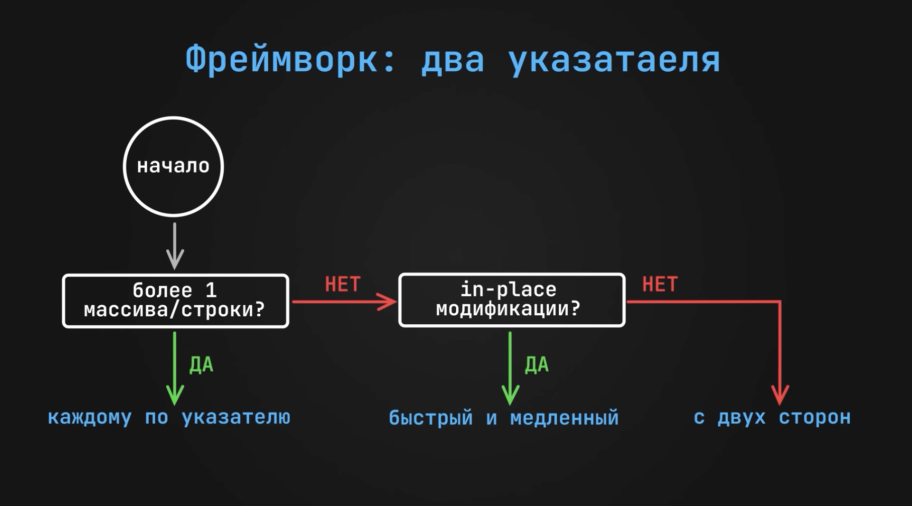

# Два указателя

## С двух сторон

#### Задача:
есть массив и число `target`
Надо найти 2 числа, которые в сумме дают target.
вернуть индексы

##### Пример
данн массив [-2, 1, 6, 9, 12, 21]
target = 18
Ответ: [2, 4]

###### Решение
двигать с начала и конца указатели, пока сумма не будет равна target



```csharp
static List<int> TwoSum(List<int> nums, int target)
{
    int l = 0;  // левый указатель (от меньшего к большему)
    int r = nums.Count - 1; // правый указатель (от большего к меньшему)


    while (l < r) // пока не дойдут друг до друга
    {
        if (nums[l] + nums[r] == target) // если дают в сумме таргет - отдаём
        {
            return new List<int>{ l, r };
        }     
        else if (nums[l] + nums[r] < target) // если сумма менньше, двигаем тот, который указывает на меньший элемент, он же l
        {
            l++;
        }
        else
        {
            r--; // если сумма больше, двигаем тот, который указывает на больший элемент, он же r
        }

    }

    return new List<int>{ -1, -1 }; // если ничего не нашли
}

```

###### Время - O(n) - проходимся 1 раз по массиву
###### Память - O(1) - всегда ответ - массив из 2 элементов


### Флаги паттерна
- По условию массив отсортирован
- задача на проверку палиндрома
- ответ формируется за счёт сужения обрасти с двух сторон


--- 


## Каждому по указателю

#### Задача:
Даны два отсортированных массива. Нужно вернуть все общие элементы

##### Пример
данны два массива
[0, 2, 4, 8, 8]
[1, 2, 2, 7, 8, 8]
Ответ: [2, 8, 8]


###### Решение
указатели каждому массиву в начало. двигаем по возрастанию, пока один из них не выйдет за границы своего массива.


```csharp
static List<int> Intersect(List<int> nums1, List<int> nums2)
{
    int fPointer = 0;
    int sPointer = 0;

    List<int> result = new();

    while (fPointer < nums1.Count && sPointer < nums2.Count) // пока в границах массива
    {
        if (nums1[fPointer] == nums2[sPointer])
        {
            result.Add(nums1[fPointer]);
            fPointer++;
            sPointer++;

            // если равны, то прибавляем оба. иначе только отстающий
        }
        else if (nums1[fPointer] < nums2[sPointer])
        {
            fPointer++;
        }
        else
        {
            sPointer++;
        }

    }

    return result;
}
```
###### Время - O(n+m) - проходимся 1 раз по каждому массиву
###### Память - O(min(n, m )) - в худшем случае пройдёмся по минимальному массиву


### Флаги паттерна
- даны несколько массивов или строк
- нужно искать объединение/пересечение и тд у двух последовательностей


---

## Быстрый и медленный

#### Задача:
Нужно перенести все 0 в конец массива без создания нового массива

##### Пример
[0, 1, 0, 0, 3, 12, 2]
Ответ: [1, 3, 12, 2, 0, 0, 0]


###### Решение
завести два указатель - быстрый и медленный. быстрый ищет не 0 элемент, и меняет его с медленным, который на 0

```csharp
static List<int> MoveZeros(List<int> nums)
{
    int slowPointer = 0;
    int fastPointer = 0;

    while (fastPointer < nums.Count) // идём, пока быстрый не выйдет за границы массива
    {
        if (nums[fastPointer] != 0) // если не 0, то медленный и быстрый идут с одним шагом, где быстрый перетаскивает назад все числа
        {
            (nums[slowPointer], nums[fastPointer]) = (nums[fastPointer], nums[slowPointer]);
            slowPointer++;

        }
        fastPointer++; // быстрый двигается дальше
    }

    return  nums;
}
```
###### Время - O(n) n - размер массива
###### Память O(1) - не создаём новый массив

### Флаги паттерна
- если заменить исходную строку/массив in-place 
- требуется сохранить исходный порядок


---


