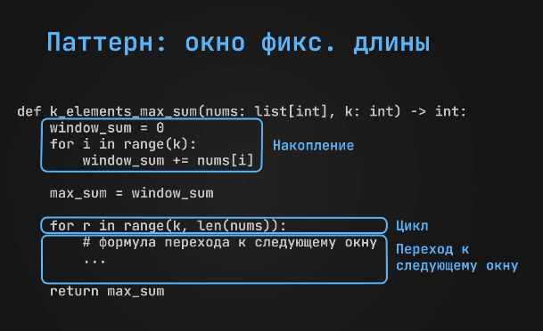
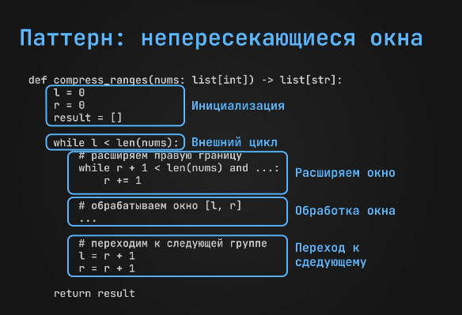
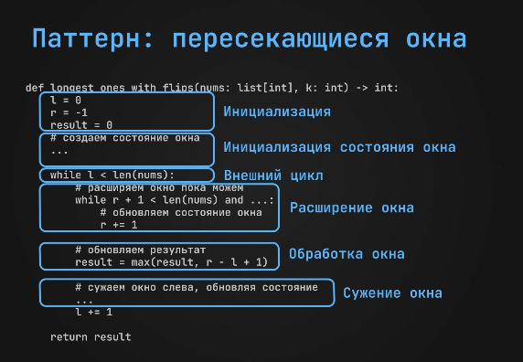
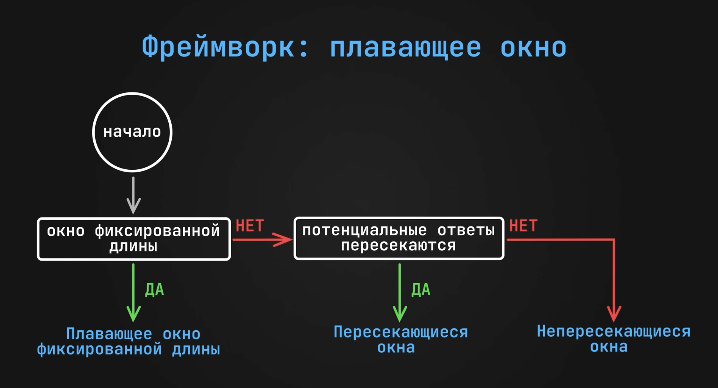

# Плавающие окно

## Окно фиксированной длины

#### Задача:
Данн массив и число `k`, нужно вернуть максимальную сумму `k` подряд идущих элементов 

##### Пример
данн массив [3, 2, 0, 9, 1, 2, 8, 5, 2]
k = 5
Ответ: 25

###### Решение
суммируем первые 5 элементов, а затем двиаем окно прибавляя новый элемент и вычитая старый.
если сумма больше, то обновляем max.



```csharp
static int KElementsMaxSum(List<int> nums, int k)
{
    int windowSum = 0;

    for(int i = 0; i < k; i++)
    {
        windowSum += nums[i]; // накапливем суму в начальном окене
    }

    int maxSum = windowSum;

    for(int r = k; r < nums.Count; r++) // двигаем два указателя в массиве с одинаковой скоростью
    {
        int l = r - k;

        windowSum = windowSum + nums[r] - nums[l];
        maxSum = Math.Max(maxSum, windowSum);
    }

    return maxSum;
}

```

###### Время - O(n)
###### Память - O(1) 


### Флаги паттерна
- дана переменная, обозначающая размер окна
- требуется работать с подряд идущими элементами


---

## Непересекающиеся окна

#### Задача:
Данн отсортированный по возрастанию массив натуральный целых чисел.
Нужно сжать его объединяя подряд идущие числа

##### Пример
данн массив [1, 2, 3, 5, 8, 9, 14]
Ответ: ["1->3", "5", "8->9" "14"]

###### Решение
двигаем правый указатель пока следующие число больше на 1. После формируем.



```csharp


```

###### Время - O(n)
###### Память - O(n) 


### Флаги паттерна
- нужно работать с подряд идущими группами элементов
- оди элемент принадлежит одной группе (группы не пересекаются)


---


## Пересекающиеся окна

#### Задача:
Данн массив из 0 и 1 и `k`. Можно заменить `k` нулей на 1. Нужно найти максимальны отрезок, где `k` нулей можно заменить.

##### Пример
данн массив [1, 0, 1, 0, 1, 0, 1, 1]
k = 2
Ответ: 6. [2, 7] 

###### Решение
сдавим два указателя на начало. заводим переменную подсчёта нулей. 
далее, пытаемся максимально расширить окно, пока не дойдём до конца, или не наберём максимальное количество нулей. 
обновляем ответ.



```csharp
static int LongestOnesWithFlips(List<int> nums, int k)
{
    int r = -1;
    int l = 0;
    int res = 0;
    int zeroCount = 0;


    while (l < nums.Count)
    {
        while ( r + 1 < nums.Count && (nums[r+1] == 1 || zeroCount < k) )
        {
            // пока не вышли за границу массива, и пока количество нулей допустимо
            if ( nums[r+1] == 0)
            {
                zeroCount++;
            }
            r++;
        }

        res = Math.Max(res, r - l + 1);

        if (nums[l] == 0)
        {
            zeroCount--;
        }

        l += 1;
    }


    return res; 
}
```

###### Время - O(n)
###### Память - O(1) 


### Флаги паттерна
- нужно работать с подряд идущими группами элементов
- один элемент принадлежит одной группе (группы нер пересекаются)


---

