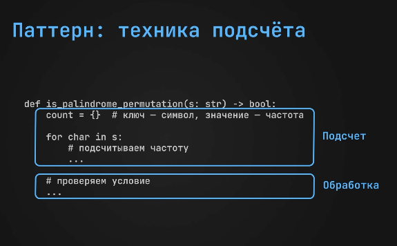
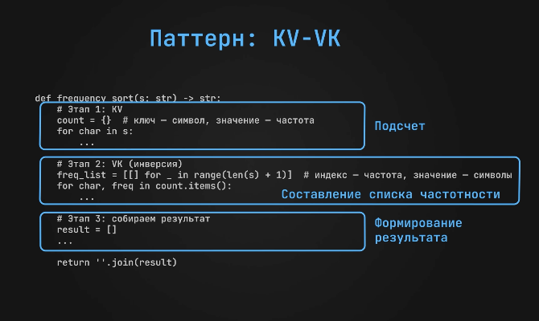
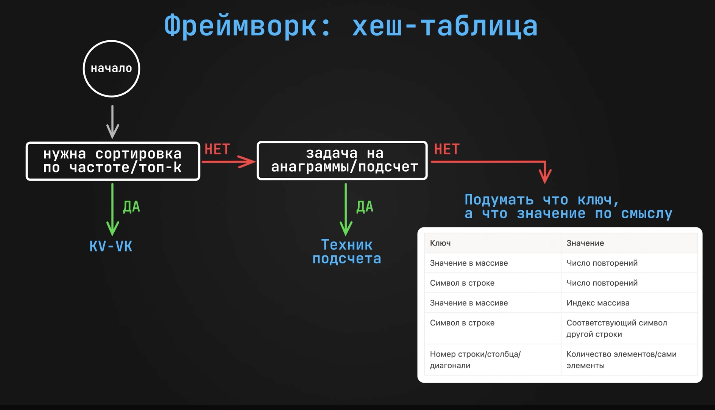

# Хеш-таблица

## Техника подсчёта

#### Задача:
Дана строка `S`. Нужно проверить, можно ли переставить её символы так, чтобы получился палиндром.

##### Пример
`ABAABCC`

Ответ: `true`

###### Решение
С помощью хеш-таблицы считаем частоту каждого символа.
Палиндром можно собрать тогда, когда символов с нечётной частотой не больше одного.



```csharp
static bool IsPalindrome(string s)
{
    Dictionary<char, int> count = new();

    for(int i = 0; i < s.Length; i++)
    {
        
        if (count.ContainsKey(s[i]))
        {
            count[s[i]]++;
        }
        else
        {
            count[s[i]] = 1;
        }

    }

    int oddCount = 0;

    foreach (var ch in count.Keys)
    {
        if (count[ch] % 2 == 1)
        {
            oddCount++;
        }
    }

    return oddCount <= 1;
}
```

###### Время - O(n)
###### Память - O(k), где `k` - количество уникальных символов


### Флаги паттерна
- задачи на анаграммы
- работа с частотой элементов


---


## KV-VK

#### Задача:
Дана строка `S`. Нужно отсортировать её символы по частоте: от самых частых к самым редким.

##### Пример
`BABBCBC`

Ответ: `BBBBCCA`

###### Решение
Сначала считаем частоту каждого символа в словаре.
Потом создаём список частот, где индекс - это количество вхождений, а значение - символы с такой частотой.


```csharp
static string FrequencySort(string s)
{
    Dictionary<char, int> count = new();

    foreach (char ch in s)
    {
        if (count.ContainsKey(ch))
            count[ch]++;
        else
            count[ch] = 1;
    }

    List<List<char>> buckets = new();
    for (int i = 0; i <= s.Length; i++)
    {
        buckets.Add(new List<char>());
    }

    foreach (var entry in count)
    {
        char ch = entry.Key;
        int freq = entry.Value;
        buckets[freq].Add(ch);
    }

    System.Text.StringBuilder result = new();

    for (int freq = buckets.Count - 1; freq >= 1; freq--)
    {
        foreach (char ch in buckets[freq])
        {
            result.Append(ch, freq);
        }
    }

    return result.ToString();
}
```

###### Время - O(n)
###### Память - O(n)


### Флаги паттерна
- задача на сортировку по частоте
- нужно искать `top-k` по некоторому свойству


--- 



